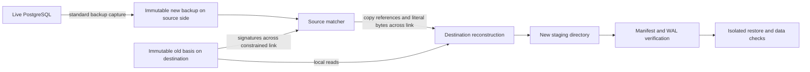

# Proposed specification v0.2

Status: review proposal updated from sponsor-chat evidence, September 30, 2026.
Normative words in this document define proposed acceptance tests, not functionality already implemented.

## 1. Objective and scope

Product objective: use an older destination copy to reduce backup transfer cost while a PostgreSQL workload remains active, preserving committed data through a declared recovery cutoff.
Compare backup duration, network traffic and application degradation with pg_basebackup across team-defined scales.
This direction and the absence of a byte-identity requirement come from Ben's messages in the supplied screenshots.
The exact guarantee and test oracle are proposed in [CORRECTNESS.md](CORRECTNESS.md).

Internal transfer milestone: given a newly completed physical backup S and an older immutable basis B, construct O whose supported file contents and directory inventory match S.
Exact reconstruction of this fixed S is a component test.
It does not require two independently captured live backups to have identical bytes.
Historical-WAL-summary independence is an optional research hypothesis, not a confirmed primary requirement.

First transfer milestone: Linux, one agreed PostgreSQL 17 build, plain backups, standard local filesystem, no external tablespaces, no user-created symlinks, and frozen inputs.
The integrated milestone captures backups while workload is active, then applies the frozen-input transfer path.
AlloyDB Omni needs its own compatibility gate on Ben's specified version.
SQL compatibility alone is not proof of interchangeable physical backup formats or recovery behavior.

Out of scope for the first transfer milestone: direct live PGDATA scanning, cross-major upgrades, arbitrary running destination directories, failover during capture, resumable partial jobs, cloud object-store output, a PostgreSQL wire-protocol extension, and full pg_basebackup option compatibility.
An active-workload end-to-end benchmark is required for the sponsor deliverable, even though direct live-filesystem scanning is deferred.
Unsupported cases fail explicitly.
They must not silently produce an incomplete backup.

## 2. Architecture and deployment boundary



Standard pg_basebackup owns live-capture correctness in this first architecture.
The new tool owns transfer and reconstruction correctness.
Never capture the full new backup over the constrained link and then claim that matching at the receiver saved traffic on that link.

The staged prototype pays for a full source backup, source scratch storage, scanning/hashing, destination basis reads, output writes, and verification.
Report these costs explicitly.
Do not promise reduced source I/O, CPU, or total latency without measurements.

Later integration choices require a decision record:

| Choice | Benefit | New obligation |
|---|---|---|
| Source-side staged backup | Stable bytes; standard backup metadata; clear correctness boundary | Full scratch space and capture time |
| Source-side helper processing the backup stream | Potentially avoid full source staging | Correct stream parsing, metadata handling, bounded buffering, WAL completion, failure cleanup |
| Direct filesystem capture with PostgreSQL backup API | More control over read path | Entire live-backup protocol, file races, exclusions, WAL retention and metadata lifecycle |
| PostgreSQL backend/protocol patch | Tight integration and possible upstream path | C backend work, compatibility, protocol design and server deployment |

A destination-only wrapper around a normal full BASE_BACKUP stream cannot remove bytes that already crossed the link.
This is an architectural inference from the [replication protocol](https://www.postgresql.org/docs/17/protocol-replication.html), not a claim that PostgreSQL has no incremental mode.

## 3. Proposed user interface

The following commands are contracts to implement, not commands currently provided:

```text
pg_delta_backup plan --source-backup S --basis B --format json
pg_delta_backup transfer --source-backup S --basis B --output O
pg_delta_backup verify --output O
```

The initial experiment may use local S and B directories to test the algorithm.
The transfer milestone requires separate processes and a measured transport boundary.
Select an authenticated transport such as SSH for the controlled lab; do not invent a custom cryptographic protocol.
Do not expose a new unauthenticated network service.

Exit codes: 0 success; 2 invalid/unsupported input; 3 transfer or I/O failure; 4 verification failure.
Structured status must include a format version and an unambiguous completion state.
Logs must not contain credentials or connection strings with passwords.

## 4. Input and output invariants

- S is complete and immutable for the whole operation, including WAL and backup metadata.
- B is read-only to the tool and must remain immutable to other writers.
- Require the same cluster system identifier, major version, block size and compatible checksum state in the first PostgreSQL-specific milestone.
- Preserve the original source backup_manifest, backup_label, control file, and required WAL bytes for exact reconstruction.
- O is a new output path; refuse an existing output and any overlap or aliasing among S, B, O, and staging.
- Do not overwrite or hard-link mutable output files to B.
- File inventory comes from S; files present only in B are not carried into O.
- Detect unsupported symlinks, tablespaces and special files before transfer; do not follow paths outside the approved roots.
- Record file sizes, content digests, required directory structure and permission policy.
- Map ownership to the intended restore user rather than assuming matching numeric UIDs on two hosts.
- Missing, corrupt, short-read, or changed inputs must fail verification rather than count as success.

Success means a verified, complete output and durable completion record.
Store job receipts outside PGDATA so they are not mistaken for unexpected backup files.
Build under a unique staging directory on the same filesystem as O, fsync files and directories as required, and atomically publish only after verification.
An interrupted operation must leave B intact and must never label a partial output complete.
MVP may restart from scratch; resumability is a separate design.

## 5. Chunking and matching contract

Start with fixed 8 KiB chunks on relation data for the usual PostgreSQL page size; parameterize and validate the actual build's block size.
Compare 64 KiB fixed chunks and content-defined chunks later.
The initial matcher may use a per-file index keyed by `(length, SHA-256(bytes))`, returning a basis offset for a match.
Do not use a weak rolling hash alone to authorize reuse.
Do not infer equality from modification times or file lengths.

On receipt, a reused block is re-read and validated against the expected content digest before being written.
The output file digest is checked against the source digest.
The PostgreSQL manifest is verified independently.
Strong digests make accidental collision extremely unlikely; they are not mathematical proof of byte equality or database recoverability.
Test with byte-for-byte comparisons in fixtures and restore checks in database tests.

Match within the same file first.
Cross-file matching, persistent indexes, concurrency and compression are experiments after the correctness path works.
Do not hash an entire cluster into an unbounded in-memory dictionary.
At 1 TiB / 8 KiB there are 134,217,728 chunks; SHA-256 digests alone take 4 GiB before offsets and object overhead.
Process one file or bounded window at a time, define an explicit memory budget, and measure the fallback behavior when it is exceeded.

## 6. Versioned transfer contract

Define the serialization in a protocol decision record before two independent implementations begin.
The following logical messages are language-independent:

| Message | Required fields | Receiver checks |
|---|---|---|
| Session | protocol version, source identity, basis identity, chunk/hash settings | Supported version and compatible immutable inputs |
| FileStart | relative path, type, size, mode, source digest | Safe path, no duplicate entry, supported file type, size bound |
| Copy | basis file identity, offset, length, expected digest | Bounds, length, basis digest and unchanged basis |
| Data | length, bytes, expected digest | Declared length, configured frame bound, digest |
| FileEnd | final byte count and source digest | Exact length and whole-file verification |
| Complete | inventory digest, file count, verification status | No missing/extra files; all required metadata and WAL present |

Offsets and lengths are unsigned 64-bit integers in the future wire representation with checked arithmetic.
Limit frame and path lengths and reject unknown mandatory fields/messages.
Consecutive output coverage must be exact: no overlaps, gaps, or writes beyond declared size.
The protocol carries the source inventory, including empty files and directories.
Do not trust paths received from the peer.

## 7. Correctness gates

| Gate | Acceptance criterion |
|---|---|
| G0: ordinary bytes | Exact reconstruction for empty files, identical bytes, overwrite, append, truncate, delete, rename, reordering, and complete rewrite |
| G1: failure handling | Corrupt literals/references, wrong basis, truncation, interrupted transfer, disk-full and invalid paths fail without publishing a complete output |
| G2: backup integrity | Reconstructed completed backup passes matching-major pg_verifybackup with WAL parsing enabled |
| G3: restore | Isolated PostgreSQL reaches a declared recovery target and matches expected committed data, schema and transaction invariants; aborted/uncommitted effects are absent |
| G4: live capture | Required sponsor milestone: sustained write workload during capture; pass G2/G3 and record capture-end, coverage and publication boundaries separately |
| G5: target platform | Ben's exact Omni version and deployment pass agreed tests; PostgreSQL results alone are insufficient |
| G6: usefulness | Backup time, both-direction traffic and application degradation compared under active workload; include no-backup workload baseline, native full/incremental and transfer-level rsync comparisons |

[pg_verifybackup explicitly does not replace a test restore](https://www.postgresql.org/docs/17/app-pgverifybackup.html).
Never boot the sole retained backup or basis for a test because recovery changes its files.
Boot a disposable copy in an isolated environment.

## 8. Acceptance of the first milestone

On an agreed PostgreSQL 17 build, create a full basis backup, apply a deterministic workload, and capture a new full backup on the source side.
Transfer/reconstruct that exact new backup using the basis.
Verify the output, restore a copy, and check deterministic row contents and schema.
Report literal bytes, reused bytes, signatures, protocol overhead, WAL, capture time, transfer time, verification time and restore time.
Demonstrate one failure case that preserves the old backup.
No performance percentage is a sponsor-approved target yet.

## 9. Decisions pending

Ben: destination-copy type and deployment restrictions; source-helper permission; target versions; upstream integration and repo/license constraints; any specific customer scenario or budget limit.
Team: proposed recovery contract, workload scales, milestone dates, implementation language, wire encoding, memory budget, ownership and first test machine.
Present the team's choices for feedback instead of asking Ben to define the plan.
These do not block reading, the educational experiment, native backup/restore baselines, or a reviewed design.
